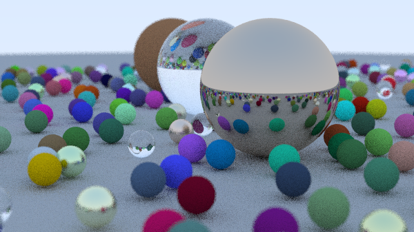
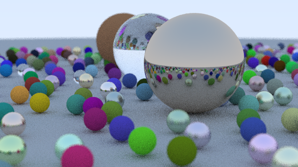
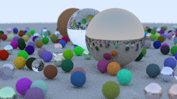

# RAYT

Ray Tracing codes. I follow Peter Shirley's [Ray Tracing](https://raytracing.github.io/) trilogy. The goal is to have the same output in three languages; C++, Python, and Rust.


## Build C++ Project

**One Weekend:**



**Next Week:**


CMake will generate makefiles for your operating system. If you didn't use CMake before, take a look at the documentation to learn how to build a C++ project. Example usage:

```shell
cd rayt-cpp
cmake -S . -B build -DCMAKE_BUILD_TYPE=Release
cmake --build build
cmake --install build && strip build/bin/*
./build/bin/rayt_one_weekend > rayt_cpp_one_weekend.ppm
./build/bin/rayt_next_week > rayt_cpp_next_week.ppm
```

For Windows use Visual Studio with C++ build tools directly.

Performance status (image width is 600px):

```
time ./bin/rayt_one_weekend > image_one_weekend.ppm

Scanlines remaining: 0
Done.

real    0m21.853s
user    0m21.582s
sys     0m0.011s
```

## Build Rust Project



I'll add a screenshot when the Rust project is ready.

```
cargo build --release
strip target/release/rayt  # for linux and macos
./target/release/rayt > image.ppm
```

Performance status (image width is 600px):

```
time ./target/release/rayt > image.ppm

Scanlines remaining: 0
Done.

real    0m51.454s
user    0m26.004s
sys     0m1.428s
```

## Build Python Project



I tested the project using the latest stable version of Python (3.8).

```
cd rayt-python
pip install -r requirements.txt
python setup.py build_ext --inplace
python -m rayt_python.main > image.ppm
```

For development:
```
pip install -r requirements-dev.txt
python -m scalene rayt_python/main.py --html --outfile scalene.html
python -m pytest -s
python -m pytest -s -k test_subtraction
```

Performance status (image width is 300px):

```
time python -m rayt_python.main > image.ppm

Scanlines remaining: 1
Done.

real    5m34.828s
user    63m33.183s
sys     0m3.051s
```
