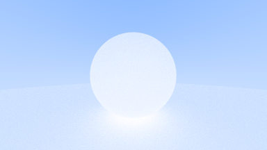

# RAYT (NOT COMPLETED)

Ray Tracing codes. I follow Peter Shirley's [Ray Tracing](https://raytracing.github.io/) trilogy. The goal is to have the same output in three languages; C++, Python, and Rust. Current status is:



## Build C++ Project

CMake will generate makefiles for your operating system. If you didn't use CMake before, take a look at the documentation to learn how to build a C++ project. Example usage:

```
cd rayt-cpp
cmake . -G "NMake Makefiles" -B build
cd build
nmake install
bin\rayt-cpp.exe > image.ppm
```

## Build Rust Project

**TODO:**

## Build Python Project

I tested the project using the latest stable version of Python (3.8). Use poetry to manage commands and dependencies.

```
cd rayt-python
poetry run rayt
```
