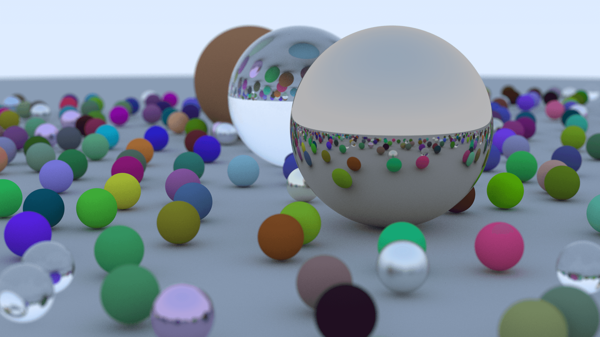

# RAYT

Ray Tracing codes. I follow Peter Shirley's [Ray Tracing](https://raytracing.github.io/) trilogy. The goal is to have the same output in three languages; C++, Python, and Rust.



## Build C++ Project


CMake will generate makefiles for your operating system. If you didn't use CMake before, take a look at the documentation to learn how to build a C++ project. Example usage:

```
cd rayt-cpp
cmake . -G "NMake Makefiles" -B build
cd build
nmake install
bin\rayt-cpp.exe > image.ppm
```

## Build Rust Project

**TODO:**

## Build Python Project


I tested the project using the latest stable version of Python (3.8).

```
cd rayt-python
pip install -r requirements.txt
python setup.py build_ext --inplace
python -m rayt_python.main
```

For development:
```
pip install -r requirements-dev.txt
python -m scalene rayt_python/main.py --html --outfile scalene.html
python -m pytest -s
python -m pytest -s -k test_subtraction
```

### TODO

- [ ] immutable objects conversion.
- [ ] inline functions conversion.
- [ ] use dataclass for structure types.
- [ ] use async for performance improvements.
